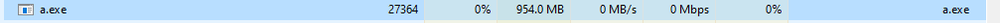
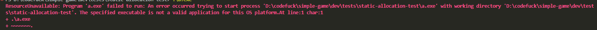

# Purpose
To determine how large windows allows static memory to be allocated

# Summary
Windows will allocate up to a GB of memory without question:  
  
After this size, however, for an integer virtual allocation will likely be required:  
    
When using a long to allocate, the program launches but crashes immediately when trying to access
the memory. Likewise, subsequent launches with excess memory seem to sparsely allocate empty pages.
